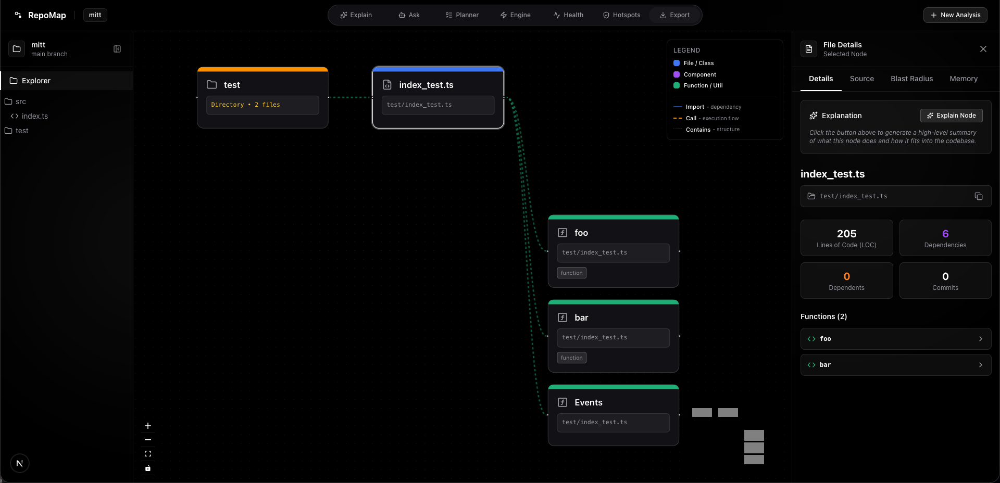

# 🗺️ RepoMap — Google Maps for Source Code

[](https://opensource.org/licenses/MIT)
[](http://makeapullrequest.com)

<p align="center">
  <strong><a href="https://repomap.armanx.online">🚀 Try RepoMap Live Here</a></strong>
</p>

<p align="center">
  
</p>

<h3 align="center">
  AST-Driven Interactive Spatial Knowledge Graph & Multi-Agent Architecture Explorer
</h3>

<p align="center">
  Turn dense, complex GitHub repositories into explorable 2D spatial maps. Zoom effortlessly from macro system architecture down to inline AST function calls with zero configuration.
</p>

---

## 📸 Product Overview

<p align="center">
  
</p>
<p align="center">
  <em>Navigate huge codebases visually with auto-generated dependency graphs.</em>
</p>

---

## ✨ The Problem vs. The RepoMap Solution

### 🧠 The Pain: Miller's Law & Tab Fatigue
Human working memory holds only ~7 items at a time. Tracing code logic across dozens of disconnected IDE tabs forces continuous cognitive re-indexing, spatial disorientation, and mental fatigue.

### 🗺️ The Solution: Deterministic 2D Cartography
Human spatial memory recalls physical coordinates and visual structures instinctively. **RepoMap** parses your repository's Abstract Syntax Tree (AST), extracts exact module dependencies and function definitions, and pins them onto a persistent, deterministic 2D grid.

### ⚡ The Payoff: Flow State & AI Mastery
Onboard in hours instead of weeks. Inspect live function call chains, trace execution pipelines, query multi-agent AI assistants, and export presentation-ready diagrams side-by-side without ever leaving your visual context.

---

## 🌟 Key Features

- **🎯 AST-Verified Spatial Knowledge Graph**: Automatically parses AST imports, exports, and call hierarchies to generate an interactive, drag-and-zoom 2D node map.
- **🖼️ High-Density Cardless Editorial UI**: Designed with modern monochrome typography, sleek glassmorphic aesthetics, and dynamic scroll animations for maximum spatial clarity.
- **🤖 Multi-Agent AI Architectural Assistant**: Deeply integrated with **Google Gemini 2.5 Flash** (and fallback **Llama 3 via Groq**) to generate instant high-level summaries, explain complex functions, and answer architectural questions.
- **🔍 Split-Screen Code & Call Tracing**: Click any node or function to inspect source code, verify callers/callees (`[Entry] ──► [Auth] ──► [DB]`), and explore the module connections.
- **⚡ Instant 0-Second Setup**: Paste any public GitHub repository link (`owner/repository` or full URL) with zero backend indexing or manifest files required.
- **📊 Draw.io XML Export**: Export clean, presentation-ready architectural blueprints directly from your browser to Draw.io (`.drawio` / XML).
- **💾 Offline Smart Caching**: Repository topologies, parsed AST graphs, and opened files are cached locally inside `IndexedDB` for lightning-fast re-navigation.

---


## 👥 Tailored Superpowers for Every Role

| Persona | Primary Goal | How RepoMap Supercharges Workflow |
| :--- | :--- | :--- |
| **Onboarding Engineers & New Hires** | Fast-Track Mastery | Understand system architecture and module relationships in hours instead of spending weeks lost in directory trees. |
| **Staff Architects & Tech Leads** | System Audit & Blueprints | Map dependency layers, identify circular references, and export Draw.io presentation diagrams. |
| **Full-Stack & Systems Developers** | Live Call Chain Tracing | Trace request pipelines right from API endpoints down to database models using the interactive spatial map. |
| **Security Analysts & Code Reviewers** | Data Flow Inspection | Rapidly follow user input sources and sensitive data flows across disconnected modules with zero context switching. |

---

## 🛠️ Technology Stack

### Frontend (`client/`)
- **Core Framework**: Next.js 15 / React 19 (`App Router`)
- **Graph Visualization**: React Flow (with custom AST node types & layout algorithms)
- **Styling & Animation**: Tailwind CSS v4, Lucide Icons, and Intersection Observers (`ScrollReveal`)
- **Client Caching**: IndexedDB (via `idb`) for persistence
- **Syntax & Markdown**: `react-syntax-highlighter`, `react-markdown`

### Backend (`server/` & `parser/`)
- **Core Server**: Node.js & Express (TypeScript)
- **Git Engine**: `simple-git` for real-time repository cloning
- **AST Parsing Engine**: Custom multi-language AST and regex-based dependency mapping engine (`parser/`)
- **AI Orchestration**: `@google/genai` (Gemini) with fallback to `groq-sdk` (Llama 3) for the Q&A and architectural explanations.

---

## 🚀 Getting Started Locally

### Prerequisites
- **Node.js** (v18 or higher)
- **npm**, **yarn**, or **pnpm**
- An optional [Google Gemini API Key](https://aistudio.google.com/) or [Groq API Key](https://console.groq.com/keys) for AI Q&A and Flow Generation.

### 1. Backend & Parser Setup

Open a terminal and navigate to the `server` directory:

```bash
cd server
npm install
```
*(Note: Installing the server dependencies will automatically trigger the `parser/` setup scripts).*

**Configure Environment Variables:**
Create a `.env` file inside the `server/` directory:
```bash
cp .env.example .env
```
Add your API keys and port settings inside `server/.env`:
```env
PORT=5001
GEMINI_API_KEY=your_gemini_api_key_here
GROQ_API_KEY=your_groq_api_key_here_as_fallback
```

**Start the Backend Server:**
```bash
npm run dev
```

### 2. Frontend Client Setup

Open a new terminal window and navigate to the `client` directory:

```bash
cd client
npm install
```

**Configure Environment Variables:**
Create a `.env` file inside the `client/` directory:
```bash
cp .env.example .env
```
Ensure `NEXT_PUBLIC_API_URL` points to your running backend server:
```env
NEXT_PUBLIC_API_URL=http://localhost:5001
```

**Start the Frontend Client:**
```bash
npm run dev
```

The application will be live at **[http://localhost:3000](http://localhost:3000)**!

### 3. Using Docker (Alternative Setup)

If you prefer using Docker, you can spin up the entire full-stack environment with a single command.

1. **Create Root `.env` File**:
   Create a `.env` file in the root directory of the project to provide your API keys to the containers:
   ```env
   GEMINI_API_KEY=your_gemini_api_key_here
   GROQ_API_KEY=your_groq_api_key_here_as_fallback
   ```

2. **Start the Containers**:
   ```bash
   docker-compose up --build
   ```

3. **Access the App**: The frontend will be available at [http://localhost:3000](http://localhost:3000) and the backend API at `http://localhost:5001`.

*(To run the containers in the background, use `docker-compose up -d --build`. To stop them, run `docker-compose down`.)*

---

## 📖 Core Workflow & Architecture Guide

RepoMap is designed to mimic the cognitive model of a seasoned architect exploring a new codebase. Here is how the system processes your repositories:

1. **Connect & Clone**: Paste any public GitHub repository URL into the top search bar. The backend `simple-git` engine securely clones a shallow copy of the repository into temporary storage.
2. **AST Parsing & Mapping**: The core `parser/` engine traverses the directory tree, reading file contents and constructing an Abstract Syntax Tree (AST) for supported languages. It maps exact function definitions, classes, and cross-file imports to build a comprehensive dependency graph.
3. **Spatial Graph Generation**: The parsed JSON map is streamed to the frontend, where `React Flow` dynamically calculates node positions, grouping files by directory and generating bezier curve edges to represent dependencies.
4. **Explore Spatially**: Click and drag anywhere on the canvas to pan. Use the scroll wheel to smoothly zoom from a macro "bird's-eye" directory view down to individual, actionable file nodes.
5. **Inspect Source & AI Explain**: Click any node to slide open the side inspection panel. From here, you can view the raw syntax-highlighted source code, verify callers and callees, or click **Explain** to have the AI agents break down complex logic in plain English.
6. **Export Blueprints**: Click the export option in the top right to download a highly-structured `.drawio` XML file, perfect for embedding in your own documentation or presentations.

---

## 🤝 Contribute

RepoMap is open source and we welcome contributions! Please read our [Contributing Guidelines](CONTRIBUTING.md) and our [Code of Conduct](CODE_OF_CONDUCT.md) to get started.

---

## 📜 License

This project is licensed under the [MIT License](LICENSE).
