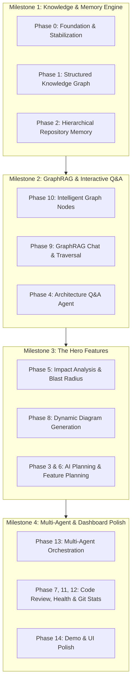

# RepoMind — Architecture, Roadmap & Implementation Specification

**RepoMind** transforms RepoMap (`v1`) from a static code summarization and visualization tool into an **AI Software Architect** that understands an entire repository's topological structure, design patterns, dependencies, and blast radius.

---

## Executive Summary & Milestone Grouping

To execute this 14-phase roadmap efficiently and achieve rapid, reliable delivery, the work is organized into **Four Strategic Milestones**:



---

## Detailed Phase-by-Phase Specification & Decision Matrix

### Phase 0 — Foundation & Stabilization (`Completed / Verified`)
* **Objective:** Ensure stable repository cloning, high-speed AST parsing across languages, clean API routing, and robust frontend rendering.
* **Implementation & Status:**
  - `parser`: Multi-language scanner utilizing `glob` and `fs`, extracting functions, imports, and calls via ts-morph/regex.
  - `server`: Express API with memory/disk cache (`repoRegistry.ts`) and on-the-fly cloning (`repoclone.ts`).
  - `client`: Next.js 16 App Router with Tailwind CSS, React Flow visualization (`RepoGraph.tsx`), and IndexedDB caching.
* **Key Decisions Made:**
  - **Decision:** Use child processes (`exec`) to run the parser asynchronously so large repositories do not block the Express event loop.
  - **Decision:** Add directory traversal protection (`path.resolve` check) and re-clone recovery on server restarts.

---

### Phase 1 — Repository Knowledge Base (`Completed`)
* **Objective:** Replace flat file parsing with a rich, structured graph schema (`ClassNode`, `InterfaceNode`, `FolderNode`, `ApiEndpoint`, `TechStackMetadata`).
* **Implementation:**
  - Created `classExtractor.ts` for cross-language class/interface/struct detection (`extendsClass`, `implementsInterfaces`).
  - Created `apiExtractor.ts` for Express, Next.js App Router, FastAPI, Spring Boot, and Go Chi/Gin route handler matching (`POST /analyze` $\rightarrow$ `analyzeRepo`).
  - Created `techStackExtractor.ts` to inspect manifest files (`package.json`, `requirements.txt`, `go.mod`) and language distribution.
  - Updated `graphBuilder.ts` to output `folder::*` nodes and maintain parent-child `contains` edges across folders, files, classes, interfaces, and functions.
* **Key Decisions Made:**
  - **Decision (Folder Hierarchy as Nodes):** Folders are explicitly modeled as nodes (`folder::path`) with `contains` edges. This enables map-reduce hierarchical summaries in Phase 2.
  - **Decision (Cross-File API Resolution):** Route registration (in `repoRoutes.ts`) resolves handler symbol names to function definitions across separate files (`repoController.ts`), bridging architectural layers.

---

### Phase 2 — Repository Memory (`Completed`)
* **Objective:** Generate and persist hierarchical AI summaries (`Architecture`, `Subsystem Folders`, `API Catalog`, `Coding Conventions`, `Glossary`) so future prompts use persistent memory rather than raw code.
* **Implementation Plan:**
  - **Data Schema (`server/src/store/memoryStore.ts`)**:
    ```typescript
    export interface RepoMemory {
      repoId: string;
      techStackOverview: string;
      systemArchitecture: string;
      codingConventions: string[];
      domainConcepts: Record<string, string>;
      folderSummaries: Record<string, string>; // folderId -> summary
      apiDocumentation: Array<{ route: string; method: string; summary: string }>;
      updatedAt: number;
    }
    ```
  - **Summarization Pipeline (`server/src/services/memoryBuilder.ts`)**:
    - **Level 1 (Folder Summaries):** For each `folder` node in Phase 1, pass its file descriptions and exported functions to `gemini-1.5-flash` or `llama-3.3-70b` to generate a concise 3-sentence module summary.
    - **Level 2 (System Architecture):** Aggregates folder summaries + `techStack` to generate the global architecture and conventions.
* **Key Decisions & Trade-offs:**
  - **Decision (Hierarchical Map-Reduce vs. Full Dump):** Summarize bottom-up (`Files` $\rightarrow$ `Folders` $\rightarrow$ `System`). Feeding 50,000 lines of code at once causes context dilution and high latency.
  - **Decision (Storage Engine):** Store `RepoMemory` as JSON on disk (`/temp/memory/${hash}.json`) and cache in `client` IndexedDB. This avoids needing an external vector database while maintaining instant loads.

---

### Phase 3 — AI Planning Agent (`Completed`)
* **Objective:** Intercept feature/bug requests, analyze the graph to find affected files, estimate complexity, and output a structured step-by-step implementation checklist.
* **Implementation Plan:**
  - Create endpoint `POST /api/ai/plan-task` accepting `{ repoId, userPrompt }`.
  - The Planning Agent queries `RepoMemory` (from Phase 2) and performs keyword/symbol search on Phase 1 graph nodes.
  - Outputs a structured JSON checklist:
    ```json
    {
      "understanding": "...",
      "affectedFiles": ["src/controllers/authController.ts", "src/models/User.ts"],
      "complexityScore": "Medium",
      "steps": [
        { "file": "src/models/User.ts", "action": "MODIFY", "instruction": "Add role field" }
      ]
    }
    ```
* **Key Decisions:**
  - **Decision (Structured JSON Output):** Enforce JSON Schema (`response_format: { type: "json_object" }`) so the frontend can render an interactive checklist with checkboxes and diff previews.

---

### Phase 4 — Architecture Agent (System-Level Q&A) (`Completed`)
* **Objective:** Enable system-level queries (`"How does authentication work from client to DB?"`, `"What is our caching strategy?"`).
* **Implementation Plan:**
  - Create `POST /api/ai/query-architecture`.
  - Combines `RepoMemory.systemArchitecture` + `RepoMemory.domainConcepts` + relevant folder summaries.
  - If a specific flow is asked (`request lifecycle`), the agent fetches `ApiEndpoint` nodes from the Phase 1 graph and traces outward along `calls` edges to construct the exact sequence.
* **Key Decisions:**
  - **Decision (System Context Injection):** Always inject the top-level `RepoMemory` summary into the system prompt before user questions. This gives the model instant repository awareness without retrieving raw file text.

---

### Phase 5 — Impact Analysis & Blast Radius (`Completed — Flagship Feature`)
* **Objective:** Simulate changes (`"What happens if I remove or modify UserService?"`) by combining deterministic graph dependency traversal with semantic risk analysis.
* **Implementation Plan:**
  - Create `POST /api/ai/impact-analysis` accepting `{ repoId, targetNodeId, changeType: "DELETE" | "MODIFY" }`.
  - **Algorithm (Hybrid Blast Radius):**
    1. **Graph Traversal (Deterministic):** Find all nodes connected via `calledBy`, `importedBy`, and `implementsInterfaces` up to $N=3$ hops upstream.
    2. **Blast Radius Calculation:** Calculate quantitative score:
       $$\text{Risk Score} = \min\left(100, (w_1 \times \text{Direct Callers}) + (w_2 \times \text{API Endpoints Affected}) + (w_3 \times \text{In-Degree Centrality})\right)$$
    3. **Semantic Evaluation (AI):** Feed the upstream caller signatures and descriptions to the LLM to explain *what business flows break* and recommend a *Migration Strategy*.
* **Key Decisions:**
  - **Decision (Deterministic Traversal First, AI Second):** Never ask the LLM to guess what files break from raw text. Use the Phase 1 graph for 100% accurate dependency collection, then let the LLM explain the semantic impact.

---

### Phase 6 — Feature Planning (`Completed`)
* **Objective:** Generate full end-to-end multi-layer feature plans (`"Add OAuth login"` $\rightarrow$ DB changes + Backend endpoints + Frontend UI + Tests).
* **Implementation Plan:**
  - Extends Phase 3 (`Planning Agent`) with layer-specific breakdowns (`database`, `backend`, `frontend`, `documentation`).
  - Uses `techStack` from Phase 1 to ensure suggestions use the exact libraries already present (e.g., suggesting `next-auth` if `Next.js` is detected, or `passport` if `Express` is detected).
* **Key Decisions:**
  - **Decision (Tech-Stack Anchoring):** Prevent AI hallucination of incompatible frameworks by explicitly injecting `TechStackMetadata.frameworks` into the prompt constraints.

---

### Phase 7 — AI Code Review (`Completed`)
* **Objective:** Perform repository-wide or PR-level inspection for security vulnerabilities, SOLID violations, dead code, and maintainability.
* **Implementation Plan:**
  - **Dead Code Detection (Deterministic):** Any function/class node where `calledBy.length === 0 && !isExported && !apiEndpoint` is instantly flagged as **Dead Code** without using LLM tokens!
  - **Semantic Code Smells (AI):** For nodes with high cycle counts or excessive lines (`endLine - line > 150`), run targeted review prompts checking for single-responsibility violations.

---

### Phase 8 — Dynamic Diagram Generation (`Completed`)
* **Objective:** Automatically generate structural diagrams (`Sequence Diagrams`, `Class Diagrams`, `ER Diagrams`, `Component Diagrams`) using valid Mermaid syntax or React Flow structured subgraphs.
* **Implementation Plan:**
  - Create `POST /api/ai/generate-diagram-v2`.
  - Accepts `diagramType: "sequence" | "class" | "component"` and `targetSymbol`.
  - **For Sequence Diagrams:** Trace `calls` edges from an entry `ApiEndpoint` down to database/external calls, and format directly as a `mermaid` sequence diagram (`Client->>Controller: POST /analyze\nController->>Service: ...`).
  - **For Interactive UI:** Clicking a node in the generated diagram highlights the corresponding node in the live `RepoGraph.tsx` canvas!

---

### Phase 9 — Repository Chat (GraphRAG Engine) (`Completed`)
* **Objective:** Build a repository-aware chat assistant that queries the graph topology and memory rather than doing basic cosine similarity over text chunks.
* **Implementation Plan:**
  - **Hybrid GraphRAG Workflow:**
    1. Extract keywords/symbols from user prompt (`"How does jwtMiddleware authenticate requests?"`).
    2. Lookup nodes matching `jwtMiddleware` in the Phase 1 graph.
    3. Extract the **Sub-Graph Context**: The node + its direct `imports` + its `calls` + its `calledBy` + its `sourceCode` (via `getFileContent`).
    4. Send the Sub-Graph + `RepoMemory` to the LLM chat session.
* **Key Decisions:**
  - **Decision (Sub-Graph Serialization):** By sending the exact neighborhood of relevant symbols rather than random vector search chunks, the model never hallucinates missing parameters or broken imports.

---

### Phase 10 — Interactive Graph Q&A & Node Intelligence (`Completed`)
* **Objective:** Make every React Flow node intelligent. Selecting any node immediately reveals its purpose, dependencies, callers, risk level, and AI explanation.
* **Implementation Plan:**
  - Enhance `FileSidebar.tsx` and `CustomNode.tsx` on the frontend.
  - Clicking a node fetches:
    - Its exact `calls` and `calledBy` connections (highlighted visually on the graph canvas using glowing edge styles).
    - Its `apiEndpoint` badges.
    - Its pre-cached summary or on-demand `POST /api/ai/explain`.
    - Its **Blast Radius Score** (from Phase 5 calculation).

---

### Phase 11 — Repository Health Dashboard (`Completed`)
* **Objective:** Score the repository across 6 key metrics: `Architecture`, `Documentation`, `Testing`, `Security`, `Performance`, and `Maintainability`.
* **Implementation Plan:**
  - Create `POST /api/repo/health-score`.
  - **Deterministic Metrics + AI Scoring:**
    - `Documentation Score`: Ratio of functions/classes with JSDoc/docstrings.
    - `Testing Score`: Ratio of `test/` or `.spec.ts` files to implementation files.
    - `Architecture Score`: Ratio of circular dependencies (`dagre` cycle detection) and clean layer separation.
    - `Maintainability Score`: Average function length (`endLine - line`) and coupling (`imports.length`).
  - Returns numerical scores (0-100) and actionable advice for improvement.

---

### Phase 12 — Git Intelligence (`Completed`)
* **Objective:** Analyze Git history (`git log`, `git rev-list`) to identify code hotspots, high technical debt, frequently modified files, and code churn metrics.
* **Implementation Plan:**
  - Currently, `fileController.ts` already executes `git rev-list --count HEAD -- "${filePath}"`.
  - Expand this to `POST /api/repo/git-metrics`:
    - Run `git log --pretty=format: --name-only | sort | uniq -c | sort -rg | head -n 20` across the repo to identify the **Top 20 Code Hotspots (Churn)**.
    - Correlate churn with complexity: Files with high churn + high function length = **High Technical Debt Priority**.

---

### Phase 13 — Multi-Agent Workflow Engine (`Completed`)
* **Objective:** Orchestrate specialized autonomous agents (`Planner` $\rightarrow$ `Graph Search` $\rightarrow$ `Architecture` $\rightarrow$ `Impact` $\rightarrow$ `Review`) using tool calling and structured outputs.
* **Implementation Plan:**
  - Create `server/src/services/agents/Orchestrator.ts`.
  - When a complex query arrives (`"Plan a refactor of our database layer and verify blast radius"`):
    1. **Planner Agent** breaks the goal into subtasks.
    2. **Graph Search Agent** uses function tools (`searchNodesByName`, `getGraphNeighborhood`, `queryMemory`) to gather exact AST nodes.
    3. **Impact Agent** runs blast radius simulation.
    4. **Review Agent** validates the synthesized answer before returning to the user via streaming JSON.

---

### Phase 14 — Demo & UI Polish
* **Objective:** Deliver a jaw-dropping, premium experience for hackathons and enterprise presentations.
* **Implementation Plan:**
  - **One-Click GitHub Analysis:** Enter any public GitHub URL $\rightarrow$ instant cloning $\rightarrow$ AST graph generation $\rightarrow$ automatic memory creation in under 15 seconds.
  - **Live Architecture Flashlight & Micro-Animations:** Glassmorphism cards, glowing edge paths when clicking nodes, and interactive diagram toggling.
  - **Hero Features Front and Center:** Prominent tabs for `Blast Radius Simulator`, `Interactive Graph`, and `System Health Dashboard`.

---

## Next Steps for Immediate Execution

We are right here at **Phase 2 (Repository Memory)** and **Phase 5 (Impact Analysis / Blast Radius)**. 

1. **Step 2:** Build `server/src/services/memoryBuilder.ts` and `memoryStore.ts` to generate and save hierarchical AI memory summaries.
2. **Step 3:** Build `POST /api/ai/impact-analysis` (`Phase 5`) to deliver the flagship Blast Radius & Risk Score simulator.
3. **Step 4:** Connect these endpoints into the Next.js frontend (`FileSidebar.tsx`, `RepoGraph.tsx`) for interactive click-and-inspect intelligence (`Phase 10`).
